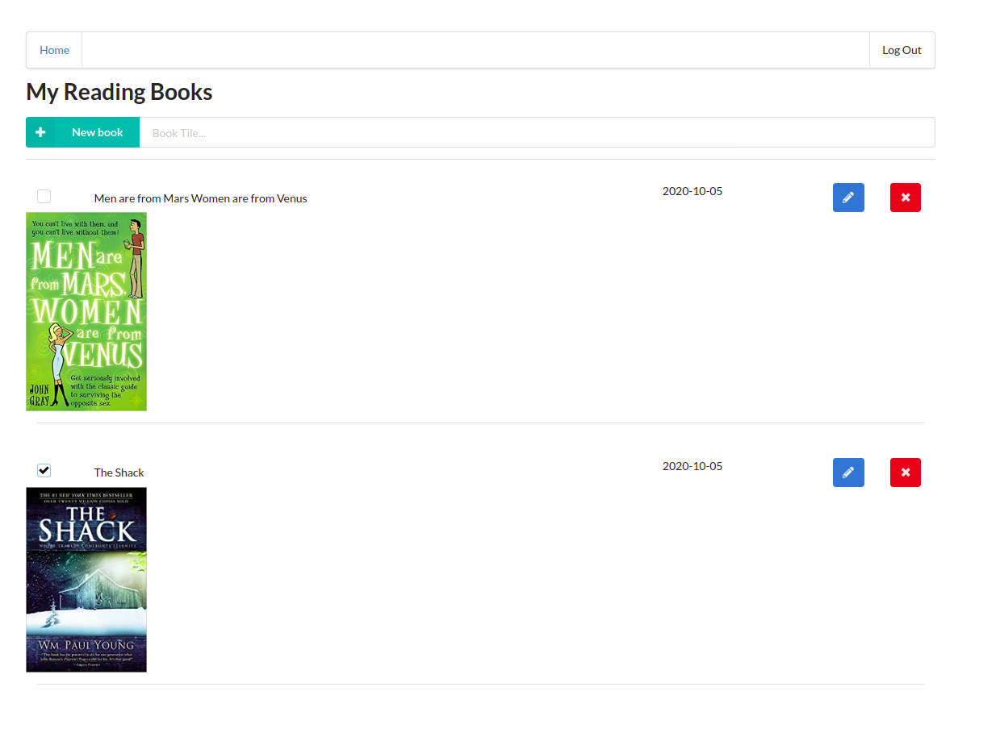

# Serverless My Reading Books

- My Reading Books is an application where the user will add all the books he wants to read in one place and update them when done.
- This is an  application using AWS Lambda and Serverless framework.

# Functionality of the application

This application will allow user to 
- Create/remove/update/fetch books.
- Each book can optionally have an attachment image.
- Each user only has access to books that he/she has created.

# Application Image



# Prerequisites

### Node.js and NPM
You need to  install [Node.js](https://nodejs.org/en/download/). 
### Serverless framework
You need to install serverless framework, you can found all the related documentations from [here](https://www.serverless.com/framework/docs/getting-started/) 

### Amazon Web Services
You must have to Amazon Web Services(AWS) to be able to deploy and use all the services required by this project

# Authentication 
I have used in the authentication for this project [Auth0](https://auth0.com/), I have used asymmetric encrypted keys.

# How to run the application

## Backend

To deploy an application run the following commands:

```
cd backend
npm install
sls deploy -v
```

## Frontend

To run a client application first edit the `client/src/config.ts` file to set correct parameters. And then run the following commands:

```
cd client
npm install
npm run start
```

This should start a development server with the React application that will interact with the serverless My Reading Books application.

# Postman collection

An alternative way to test your API, you can use the Postman collection that contains sample requests. You can find a Postman collection in this project. To import this collection, do the following.

Click on the import button:


Click on the "Choose Files":


Select a file to import:


Right click on the imported collection to set variables for the collection:


Provide variables for the collection (similarly to how this was done in the course):


